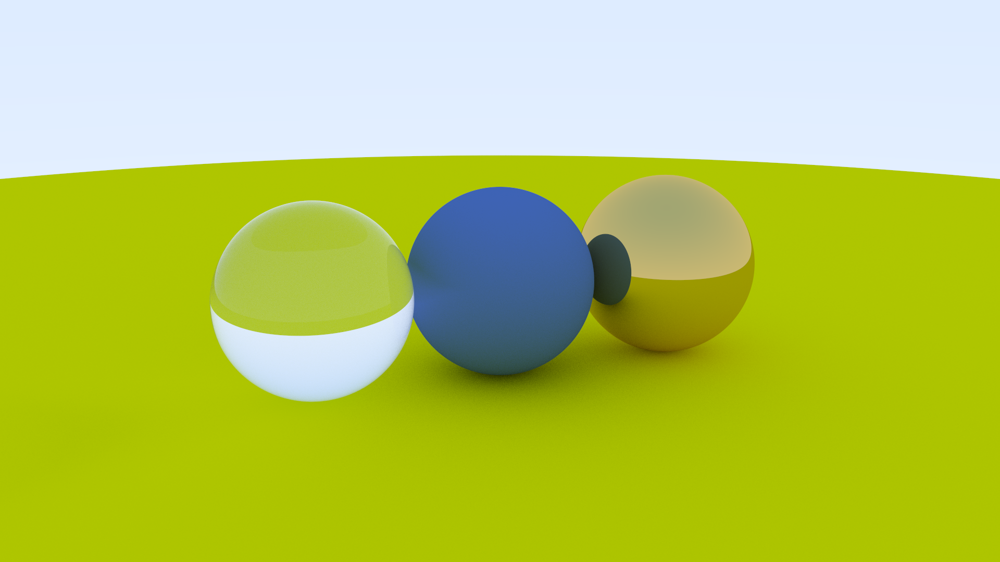

# cpu-raytracer

A lightweight CPU ray tracer based on Ray Tracing in One Weekend, implemented in C++20 and parallelized with OpenMP.



## Features
* 3D Camera System: Arbitrary camera placement (look_from), target lock (look_at), roll angle (v_up), and configurable field of view (vfov).
* Materials: Lambertian (diffuse), Metal (reflective), and Dielectric (refractive glass).
* Rendering Pipeline Multi-sample anti-aliasing (MSAA) and bounded ray bounces.
* Performance: Multi-threaded parallel rendering using OpenMP.
* Output: Streams ASCII PPM images directly to standard output.

## Requirements
* C++20 compliant compiler
* CMake 3.16 or higher
* OpenMP runtime

## Build & Run

```bash
# Configure
cmake -B build -DCMAKE_BUILD_TYPE=Release

# Build
cmake --build build --config Release

# Run and save output
./build/raytracer > output.ppm